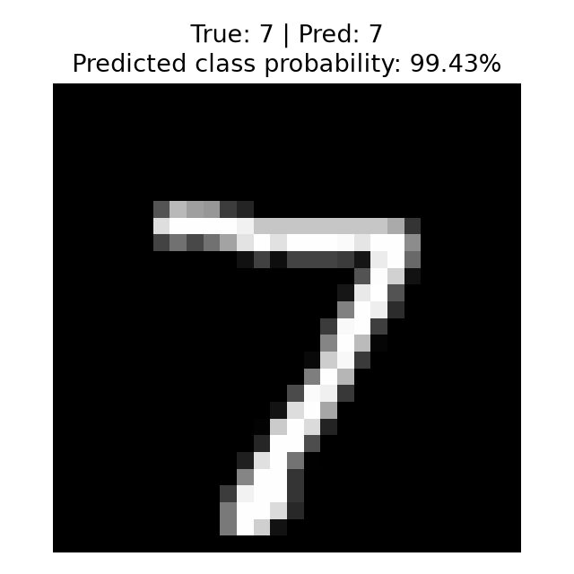

# MNIST 手写 Transformer 建模记录

日期：2026-10-08（Asia/Shanghai）；记录版本：v054；教学步骤：第52步。
阶段：首图预测可视化与真实显示数据核验。本步实际执行一次推理及绘图，没有训练或完整评估；不是仅文档更新。

## 范围、输入来源与处理（事实）

用户已提供第51步实际输出：预测7、预测类概率0.9943311214447021、概率和1.0000001192092896、GPU0 float32 shape(10,)；该项证据来自用户提供，与v053核验一致。本步接在新独立文件末尾，用Matplotlib显示当前inference_sample_index对应图片，并在标题标出真实数字、预测数字与预测类别概率。真实标签来自已加载的test_labels，仅用于展示对照，不传入预测函数。

参数仍来自 F:\PythonProjects\deep_learning\outputs\checkpoints\transformer_mnist_20261008_115104_418995.npz，SHA256 349eff0650c37163be783b58d4f39d256b796091884c624428f131d2a320f218。数据来自 C:\Users\19367\.keras\datasets\mnist.npz，SHA256 731c5ac602752760c8e48fbffcf8c3b850d9dc2a2aedcf2cc48468fc17b673d1，仍是原MNIST前1000测试图；测试第0图GPU float32 28×28，已经按保存配置255归一化一次。展示时cp.asnumpy将该图复制到CPU，原GPU图片和参数保留不变；没有新的清洗、预处理、增强或重新归一化。CPU复制仅用于Matplotlib显示。

## 假设、变量与方法选择（判断）

网络结构与参数保持v052/v053：28行token、输入28、特征32、4头、前馈64、单post-LN编码器、均值池化与10分类，20参数数组9802标量。当前inference_prediction与inference_probabilities必须来自同一个inference_sample_index；这里均为第0图。标题真实标签7、预测7、预测类softmax概率约99.43%。概率是模型输出，不能解释为经校准的正确率。

~~~text
display_image = cp.asnumpy(x_test[inference_sample_index])
true_digit = test_labels[inference_sample_index]
predicted_digit = inference_prediction
predicted_probability = inference_probabilities[predicted_digit]
~~~

选择现有Matplotlib灰度显示28×28矩阵，固定显示范围0～1、隐藏坐标轴、在标题对应图像标明真实/预测数字。此步骤只增加展示，不重复计算预测，不改动模型。用户代码plt.show弹出图像；后台为可保存证据采用已有Matplotlib的Agg并以保存PNG替代show，不安装任何依赖。

## 本步代码

[精确绘图片段](transformer_step52_visualization_fragment.txt) · [前一步预测片段](transformer_step51_standalone_fragment.txt) · [初始化与前向来源](transformer_validation_v052.py)。

~~~python
import matplotlib.pyplot as plt

# 仅为绘图，将当前这一张图片从 GPU 复制到 CPU。
image_to_show = cp.asnumpy(x_test[inference_sample_index])
true_digit = int(test_labels[inference_sample_index])
predicted_probability = float(inference_probabilities[inference_prediction])

fig, ax = plt.subplots(figsize=(4, 4))
ax.imshow(
    image_to_show, cmap="gray", vmin=0.0, vmax=1.0,
    interpolation="nearest"
)
ax.set_title(
    f"True: {true_digit} | Pred: {inference_prediction}\n"
    f"Predicted class probability: {predicted_probability:.2%}"
)
ax.axis("off")
fig.tight_layout()
plt.show()

print("真实数字:", true_digit)
print("预测数字:", inference_prediction)
print("是否预测正确:", inference_prediction == true_digit)
print("显示图片的形状:", image_to_show.shape)
~~~

## 实际执行、验证与结果（事实）

解释器 F:\PythonProjects\deep_learning\.venv\Scripts\python.exe，Python 3.13.15、NumPy 2.5.3、CuPy 14.2.0、Matplotlib 3.11.1；GPU0 NVIDIA GeForce RTX 5060。使用现有依赖，没有安装或升级。
根代理在另一只读环境检查进程确认现有Matplotlib3.11.1及默认后端tkagg；本核验进程主动选择Agg保存PNG，不将tkagg冒称本进程实际绘图后端。

核验只从v052代码AST执行初始化、存档/测试数据读取及两个前向函数定义，再执行v053精确首图预测片段一次。未执行独立文件顶层1000图评估或原训练主文件。首图返回的全部10类概率与v053保存输出逐位一致，预测7、真实7、预测类概率0.9943311214447021。本步共1次完整前向，无额外参考前向、反向、训练或参数更新。

绘图片段只调用show一次；后台截取其Figure保存PNG，并检查Axes唯一image的显示数组与cp.asnumpy(x_test[0])逐位相同，shape(28,28)、float32，cmap=gray、显示范围0～1、坐标隐藏、标题为“True: 7 | Pred: 7
Predicted class probability: 99.43%”。全部20参数、固定位置编码、GPU测试图片和CPU标签前后内容SHA256不变；核心存档、主文件、v052源码、v053预测片段及证据、当前精确片段保持字节不变。

[实际执行证据](2026-10-08_transformer_image_visualization_validation_v054.json) · [可查看PNG](mnist_test_image_0_v054.png)。JSON记录精确源码、执行前缀、依赖和GPU环境、真实一次预测stdout、绘图对象检查、参数/核心文件哈希保护与PNG哈希。相对链接已核验。v052的1000图87.50%只是历史结果，本步没有重新计算准确率。

## 与前版变化、限制及下一步

v053仅打印无标签单图预测信息，v054新增当前图片灰度显示及真实标签对照，不改变网络计算或参数。记录版本递增，教学步骤继续至52。用户自行接入片段；核验不写用户新文件或旧主文件。保留旧记录，项目索引追加，文档同步仅复制已产生文件，不再推理或绘图。

后台检查只覆盖同一存档的测试第0图，不能证明其他图全部正确，也不能推断泛化、概率校准或训练收敛。用户在新文件实际运行时，如果保留v052原1000图循环，会先完成该评估再执行追加代码；本次后台有意不重复该循环。若用户修改inference_sample_index，需要先重新调用predict_one_image生成对应预测，才能保持图像与结果一致。外部图片仍需与训练相同的尺寸、灰度和前景/背景规则。

下一步可选择其他已加载测试图片重新预测并显示，或筛选预测错误的样本观察模型错误。
